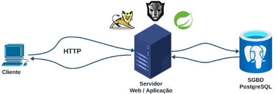

# Workshop 4 

**MATC84 Laboratório de Programação Web**

Equipe 4  - SpringBoot | JSF | Primefaces
Projeto prático para demonstração do uso das tecnologias Java Spring e Primefaces em sistemas web.

## Equipe

- [@Isaque Copque](https://www.github.com/)
- [@Isaque Copque](https://www.github.com/IsaqueCopque)

## Dependências
- spring-boot-starter-web
- spring-boot-starter-data-jpa
- postgresql
- spring-boot-starter-security
- com.auth0.java-jwt
- primefaces-spring-boot-starter

## Entidades

- Game: Representa um jogo
- GameCollection: Uma coleção de jogos de um usuário
- User: Representa um usuário
